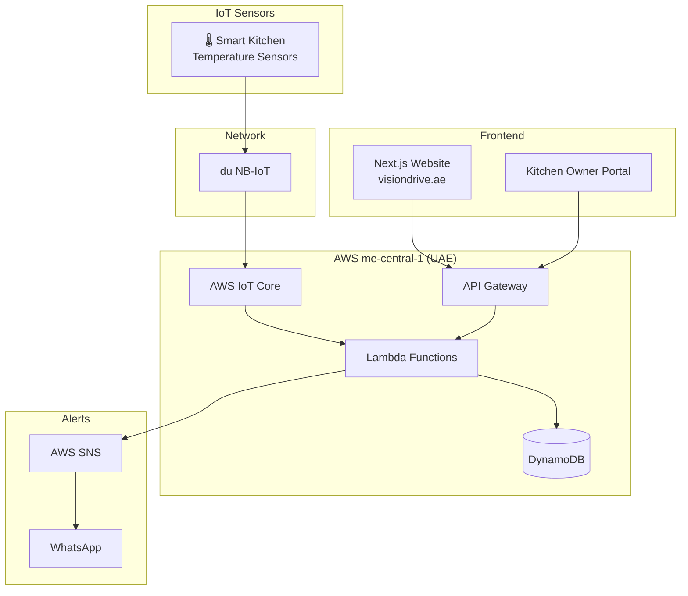

# VisionDrive Architecture

## Components

| Component | Description |
|-----------|-------------|
| **Smart Kitchen** | Dragino temperature sensors for Dubai Municipality compliance |
| **AWS IoT Core** | Sensor data ingestion |
| **Lambda** | Data processing & alerts |
| **DynamoDB** | UAE data residency storage |
| **Next.js** | Web portal at visiondrive.ae |
