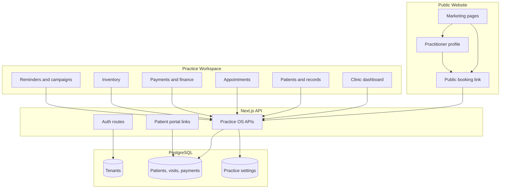

# VisionDrive Practice OS Architecture

```mermaid
flowchart TB
    subgraph Public["Public Website"]
        Home[Marketing pages]
        Booking[Public booking link]
        Profile[Practitioner profile]
    end

    subgraph App["Practice Workspace"]
        Clinic[Clinic dashboard]
        Patients[Patients and records]
        Calendar[Appointments]
        Finance[Payments and finance]
        Inventory[Inventory]
        Marketing[Reminders and campaigns]
    end

    subgraph Backend["Next.js API"]
        Auth[Auth routes]
        ClinicAPI[Practice OS APIs]
        Portal[Patient portal links]
    end

    subgraph Data["PostgreSQL"]
        Tenants[(Tenants)]
        Records[(Patients, visits, payments)]
        Settings[(Practice settings)]
    end

    Home --> Booking
    Home --> Profile
    Booking --> ClinicAPI
    Profile --> Booking
    Clinic --> ClinicAPI
    Patients --> ClinicAPI
    Calendar --> ClinicAPI
    Finance --> ClinicAPI
    Inventory --> ClinicAPI
    Marketing --> ClinicAPI
    Auth --> Tenants
    ClinicAPI --> Records
    ClinicAPI --> Settings
    Portal --> Records
```

## Components

| Component | Description |
|-----------|-------------|
| Public website | Practice OS positioning, booking, practitioner profiles, and lead capture |
| Practice workspace | Daily operations for solo practitioners and independent clinics |
| Next.js API | Authenticated APIs for clinical, operational, and financial workflows |
| PostgreSQL | Tenant-scoped practice data and audit-friendly records |
